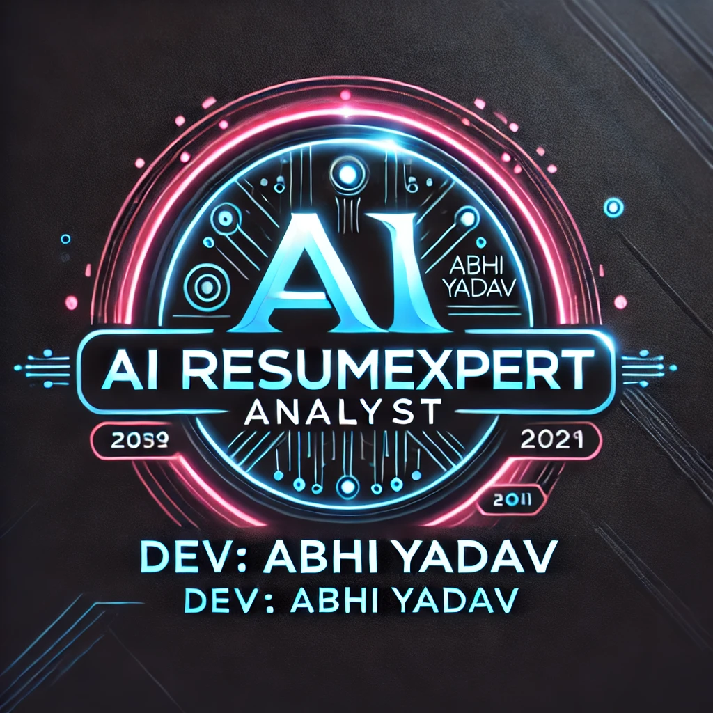

# AI-ResumeXpert-Analyst-clickable App


<p align="center">
  
  
  
  <a href="https://twitter.com/intent/follow?screen_name=abhishek_kumar">
    
  </a>
</p>

<div align="center">
<hr>
  <h1 align="center">✦ Introducing to 👨‍💻AI ResumeXpert Analyst 🤖 ✦</h1>
  
  <br><strong>
✦🌟📝 Rewrite. 🚀 Rank. 🎯 Recruit – AI ResumeXpert at Your Service!👨‍💻!🧠 ✦</strong><br><br>
	<a href=https://ai-resumexpert-analyst-2.streamlit.app/>🌍👨‍💻🚨 **Live Demo APP & Try It Yourself!**</a><strong><br><br>

  
  `## 🔥 **Project Overview**  
🌟 AI ResumeXpert Analyst is a **cutting-edge AI-powered platform** that helps job seekers **optimize their resumes**, improve **ATS compatibility**, and get **career insights**. Whether you're a **job seeker, recruiter, or developer**, this tool **analyzes resumes, ranks them, and offers AI-generated improvements**!  

✅ **Analyze resumes for strengths, weaknesses & improvements**  
✅ **Check ATS compatibility & get fixes to pass ATS filters**  
✅ **Compare resumes & get AI-powered rankings**  
✅ **Get job fit analysis, project suggestions & career guidance**  
✅ **Generate AI-based cover letters & prepare for interviews**  
✅ **100% Open-Source! Contribute, improve, and expand features!**. `<hr>
# 👨‍💻AI ResumeXpert Analyst 🤖
  

---

## 🎯 **Key Features (12 Advanced AI Capabilities)**  

### 📝 **1️⃣ Resume Analysis**  
🔹 AI-powered resume evaluation highlighting **strengths, weaknesses, and improvements**  
🔹 Get **detailed feedback** on readability, formatting, and impact  

### 📊 **2️⃣ ATS Score & Fixes**  
🔹 Ensures your resume **passes Applicant Tracking Systems (ATS)**  
🔹 Get an **ATS score out of 100** with **fixes to improve ranking**  

### 💼 **3️⃣ Job Fit Analysis**  
🔹 Match your resume with **any job description**  
🔹 Get a **job fit percentage**, missing skills, and AI-generated **job application tips**  

### 🚀 **4️⃣ AI Project Suggestions**  
🔹 AI suggests **Basic, Intermediate, and Advanced** project ideas based on your resume  
🔹 Get **tech stack recommendations** to implement projects in your domain  

### 💡 **5️⃣ Best Career Path Recommendations**  
🔹 AI analyzes **your experience & skills** to suggest the best career growth path  
🔹 Provides insights on **which industry or role fits your profile**  

### 🛠 **6️⃣ Missing Skills & Learning Guide**  
🔹 Detects **missing technical & soft skills** in your resume  
🔹 AI suggests **courses, books, and learning resources** to fill gaps  

### 🎓 **7️⃣ Certifications & Course Recommendations**  
🔹 AI recommends **top 5 industry-recognized certifications**  
🔹 Suggests **relevant online courses (Coursera, Udemy, edX, etc.)**  

### 💰 **8️⃣ Expected Salaries & Job Roles**  
🔹 AI predicts **expected salaries for different locations (USA, UK, India, Remote, etc.)**  
🔹 Lists **best job roles** based on resume analysis  

### 🏆 **9️⃣ AI Resume Ranking**  
🔹 Compare **multiple resumes** and get an AI-generated **ranking out of 100**  
🔹 Find out which resume is **stronger and how to improve**  

### 🔍 **🔟 Personalized Job Alerts**  
🔹 Get **real-time job openings** from platforms like **LinkedIn, Indeed, Naukri.com, etc.**  
🔹 AI generates **custom job search links** for quick access  

### ✉️ **1️⃣1️⃣ AI Cover Letter Generator**  
🔹 AI writes a **personalized, professional cover letter** based on your resume and job description  
🔹 Ensures **ATS compliance and strong language optimization**  

### 🎤 **1️⃣2️⃣ AI Mock Interviews & Feedback**  
🔹 AI generates **job interview questions** based on your skills & job role  
🔹 Provides **real-time feedback & improvement suggestions**  

---
## ⚙️ **Tech Stack & Tools Used**  

| Category | Tools & Technologies |
|----------|----------------------|
| **Framework** | Streamlit 🚀 |
| **AI Models** | Google Gemini AI 🤖, Hugging Face NLP 🤯 |
| **Embedding Models** | Sentence-Transformers (MiniLM-L6-V2) |
| **Vector Database** | FAISS |
| **File Handling** | PyPDF2, Python-docx |
| **Backend** | Python 🐍, LangChain |
| **Data Processing** | Pandas, NumPy |
| **Visualization** | Matplotlib, Seaborn |
| **Deployment** | Streamlit Cloud ☁️ |


---
## 🗳 **Voting System – Have a Say!**  
💡 Love this project? Support us by **starring ⭐ this repo & voting for new features!**  

✔️ **Want a feature? Vote on GitHub Issues!**  
✔️ **Have ideas? Contribute & suggest improvements!**  

🌟 **[Give us a Star ⭐ on GitHub]https://github.com/abhishekkumar62000/AI-ResumeXpert-Analyst**  

---

## 🤝 **Open Contribution – Join Our Team!**  
🚀 **AI ResumeXpert Analyst is Open Source!**  

🔹 **Fork this repo** & contribute new features  
🔹 **Report bugs & suggest improvements** in Issues  
🔹 **Join our team & collaborate!**  

---

## 🎨 **UI/UX Animations & Features**  
🎬 **Live Animations & Interactive UI/UX**  
- Modern **AI-powered UI with real-time feedback animations**  
- **Smooth transitions, dynamic resume analysis & ATS scanning**  

🔹 **Check out the AI-powered interactive experience!**  
## 🌍👨‍💻🚨 **Live Demo APP & Try It Yourself!**
:-- https://ai-resumexpert-analyst-2.streamlit.app/

:--https://ai-resumexpert-analyst.streamlit.app/  

---

## 🔥 **How to Run This Project Locally?**  

### **1️⃣ Clone This Repo**
```bash
git clone https://github.com/abhishekkumar62000/AI-ResumeXpert-Analyst.git
cd ai-resumexpert-analyst
<p align="center">
  
</p>

---
   ```
2. **Install dependencies:**
   ```bash
   pip install -r requirements.txt
   ```
3. **Run the app:**
   ```bash
   streamlit run app.py
   ```

---


## ❤️ **Made with Passion by Abhishek Yadav & Open-Source Contributors!** 🚀✨


<h1 align="center">© LICENSE </h1>

<table align="center">
  <tr>
     <td>
       <p align="center"> </img>
    </td>
    <td> 
       <br> 
This project is licensed under <a href="./LICENSE">MIT</a>. 
    </td>
  </tr>
</table>


 <hr>

<div align="center">
<a href="#"></a>
	
### **Thanks for checking out my GitHub Profile!**  

 ## 💌 Sponser

  [](https://www.buymeacoffee.com/abhishekkumar62000)

## 👨‍💻 Developer Information
**Created by **Abhishek kumar** 
**📧 Email**: [abhiydv23096@gmail.com](mailto:abhiydv23096@gmail.com)  
**🔗 LinkedIn**: [Abhishek Kumar](https://www.linkedin.com/in/abhishek-kumar-70a69829a/)  
**🐙 GitHub Profile**: [@abhishekkumar62000](https://github.com/abhishekkumar62000)  
**📸 Developer Profile Image**:- 


</div>  


`Don't forget to give A star to this repository ⭐`


`👍🏻 All Set! 💌`

</div>

